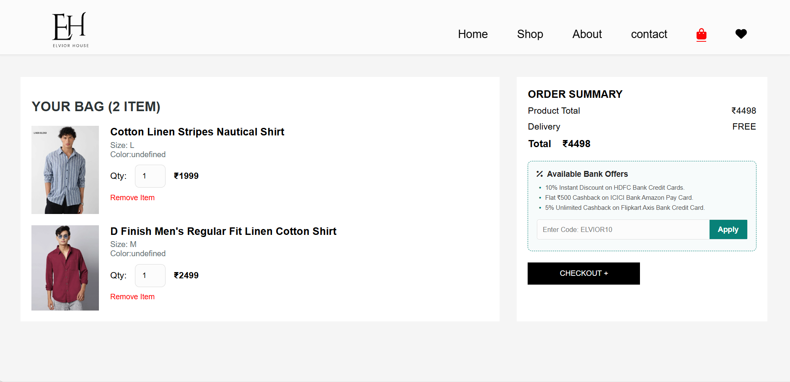
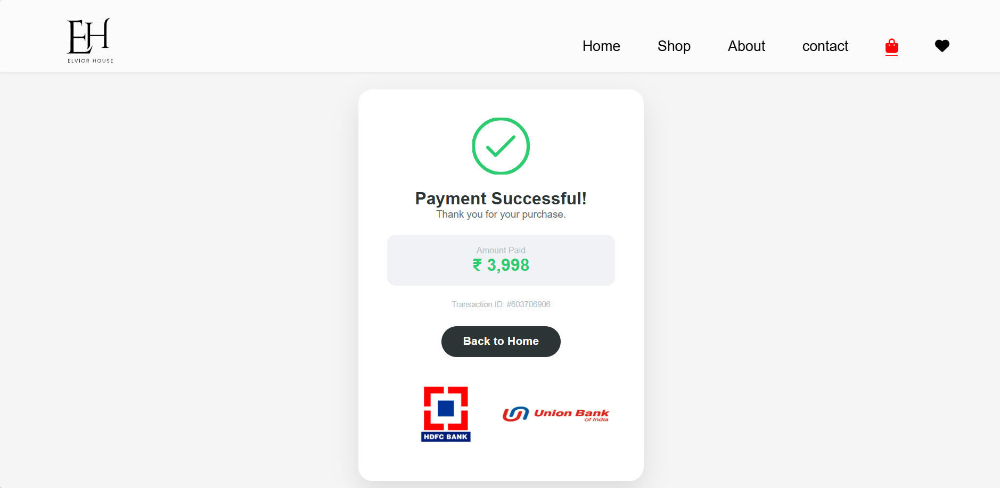

# 🛒 Ecommerce Website


A modern and responsive **Ecommerce Website** built using **HTML, CSS, and JavaScript**.
It provides a complete shopping experience including product browsing, cart system, and order flow.

---

## 🌐 Live Demo

👉   https://kalyanpolisetti.github.io/Ecommerce-Website/

---

## 📸 Screenshots

### 🏠 Home Page


### 👤 Log-In  Page


### 🛍️ Shop Page


### 🛒 Cart Page



### ✅ Order Success



### ​👢 Boots Collection Page


---

## ✨ Features

* 🏠 Attractive homepage with banners
* 🛍️ Product listing & detail pages
* 🛒 Add to cart functionality
* 📦 Cart management system
* 💳 Checkout / place order flow
* ✅ Order success confirmation
* ❤️ Wishlist feature
* 📱 Fully responsive design

---

## 🛠️ Tech Stack

* HTML5
* CSS3
* JavaScript (Vanilla JS)

---

## 📂 Folder Structure

```bash
Ecommerce-Website/
│── home-page.html
│── shop-page.html
│── cartpage.html
│── place-order.html
│
│
├── images/
├── css/
├── js/
```

---

## ⚙️ Run Locally

```bash
git clone https://github.com/kalyanpolisetti/Ecommerce-Website.git
cd Ecommerce-Website
```

👉 Open `index.html` in browser

---

## 🚀 Future Enhancements

* 🔐 Login / Signup system
* 💳 Payment integration
* 🌐 Backend (Node.js / Firebase)
* 🛒 Persistent cart (database)
* ⭐ Reviews & ratings

---

## 🙋‍♂️ Author

**Kalyan Polisetti**
📧 [mrkalyanpolisetti@gmail.com](mailto:mrkalyanpolisetti@gmail.com)
🔗 https://github.com/kalyanpolisetti

---

## ⭐ Support

If you like this project, don’t forget to ⭐ the repository!
